## useful commands

The following commands are part of [GDAL](https://www.gdal.org). The same (and much more) could be achieved with [Isis3](https://isis.astrogeology.usgs.gov), see also references on [resources](resources.md).

### visualise  map projection code (proj4)

one can use ```gdalsrsinfo```, e.g.

```
gdalsrsinfo mars.mola.cea.tif

PROJ.4 : +proj=cea +lon_0=0 +lat_ts=0 +x_0=0 +y_0=0 +a=3396190 +b=3396190 +units=m +no_defs

OGC WKT :
PROJCS["unnamed",
    GEOGCS["unnamed ellipse",
        DATUM["unknown",
            SPHEROID["unnamed",3396190,0]],
        PRIMEM["Greenwich",0],
        UNIT["degree",0.0174532925199433]],
    PROJECTION["Cylindrical_Equal_Area"],
    PARAMETER["standard_parallel_1",0],
    PARAMETER["central_meridian",0],
    PARAMETER["false_easting",0],
    PARAMETER["false_northing",0],
    UNIT["metre",1,
        AUTHORITY["EPSG","9001"]]]
```

Mars topography in Cylindrical_Equal_Area projection looks like:

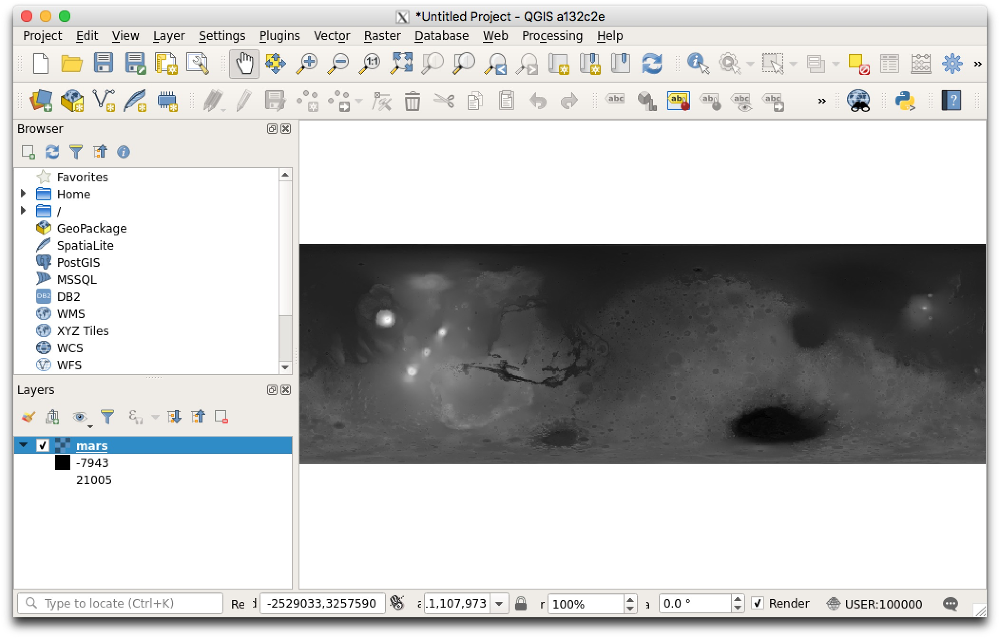

### change projection

e.g. from a Cylindrical_Equal_Area to an Equirectangular (can you spot the difference?)

#### Mars case

```
gdalwarp -s_srs "+proj=cea +lon_0=0 +lat_ts=0 +x_0=0 +y_0=0 +a=3396190 +b=3396190 +units=m +no_defs" -t_srs "+proj=eqc +lon_0=0 +lat_ts=0 +x_0=0 +y_0=0 +a=3396190 +b=3396190 +units=m +no_defs" mars.mola.cea.tif mars.mola.eqc.tif
```

Mars topography in Equirectangular projection looks like:

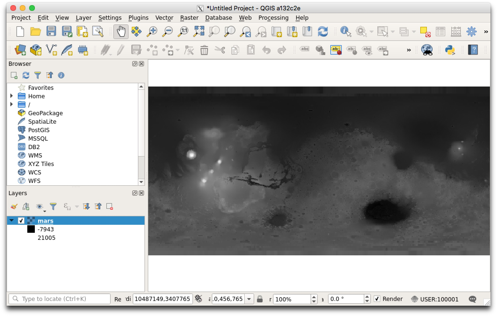

#### Moon case

```
gdalwarp -s_srs "+proj=cea +lon_0=0 +lat_ts=0 +x_0=0 +y_0=0 +a=1737400 +b=1737400 +units=m +no_defs" -t_srs "+proj=eqc +lon_0=0 +lat_ts=0 +x_0=0 +y_0=0 +a=1737400 +b=1737400 +units=m +no_defs" moon.lola.cea.tif moon.lola.eqc.tif
```

#### Mercury

```
gdalwarp -s_srs "+proj=cea +lon_0=0 +lat_ts=0 +x_0=0 +y_0=0 +a=2439700 +b=2439700 +units=m +no_defs" -t_srs "+proj=eqc +lon_0=0 +lat_ts=0 +x_0=0 +y_0=0 +a=2439700 +b=2439700 +units=m +no_defs" mercury.mla.cea.tif mercury.mla.eqc.tif
```

#### Venus case

```
gdalwarp -s_srs "+proj=cea +lon_0=0 +lat_ts=0 +x_0=0 +y_0=0 +a=6051800 +b=6051800 +units=m +no_defs" -t_srs "+proj=eqc +lon_0=0 +lat_ts=0 +x_0=0 +y_0=0 +a=6051800 +b=6051800 +units=m +no_defs" venus.magellan.filled.cea.tif venus.magellan.filled.eqc.tif
```

One can change the Moon topography to something similar to what one would see from Earth

```
gdalwarp -s_srs "+proj=cea +lon_0=0 +lat_ts=0 +x_0=0 +y_0=0 +a=1737400 +b=1737400 +units=m +no_defs" -t_srs "+proj=ortho +lon_0=0 +lat_ts=0 +x_0=0 +y_0=0 +a=1737400 +b=1737400 +units=m +no_defs" moon.lola.cea.tif moon.lola.ortho.tif
```

It is a bit easier using imagery rather than topography:


```
gdalwarp -s_srs "+proj=cea +lon_0=0 +lat_ts=0 +x_0=0 +y_0=0 +a=1737400 +b=1737400 +units=m +no_defs" -t_srs "+proj=ortho +lon_0=0 +lat_ts=0 +x_0=0 +y_0=0 +a=1737400 +b=1737400 +units=m +no_defs" moon.image.eqc.cub moon.image.ortho.tif
```

i.e.

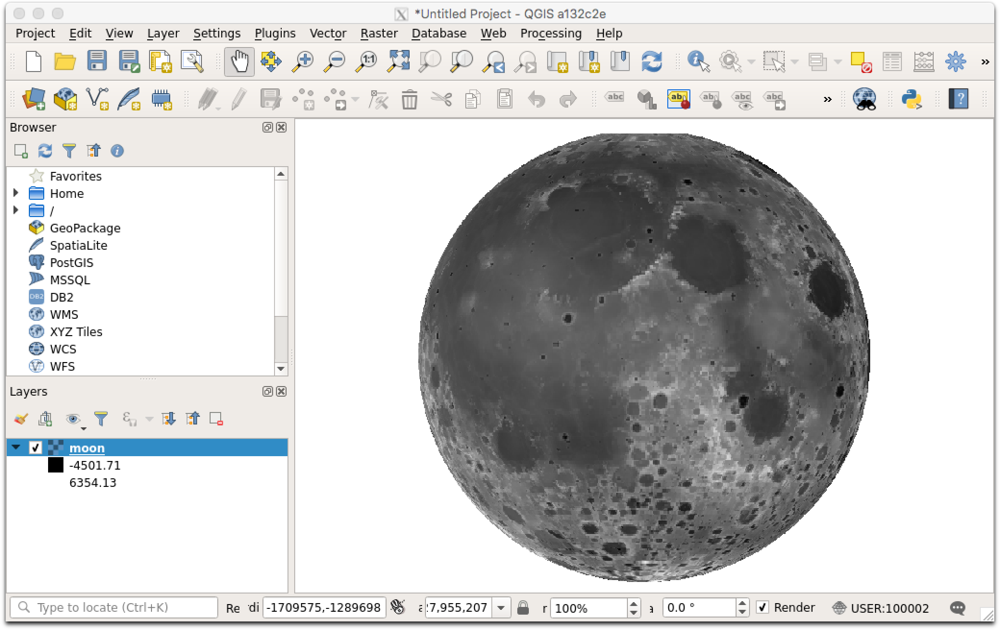

or in color

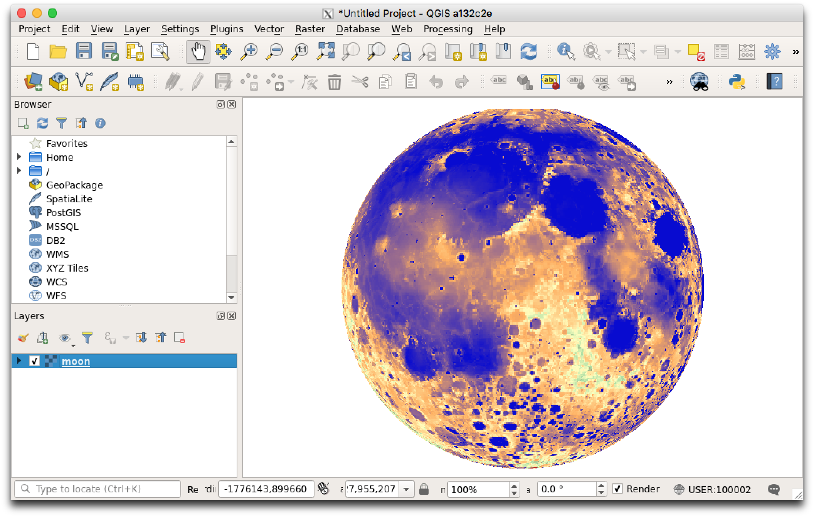

vs.

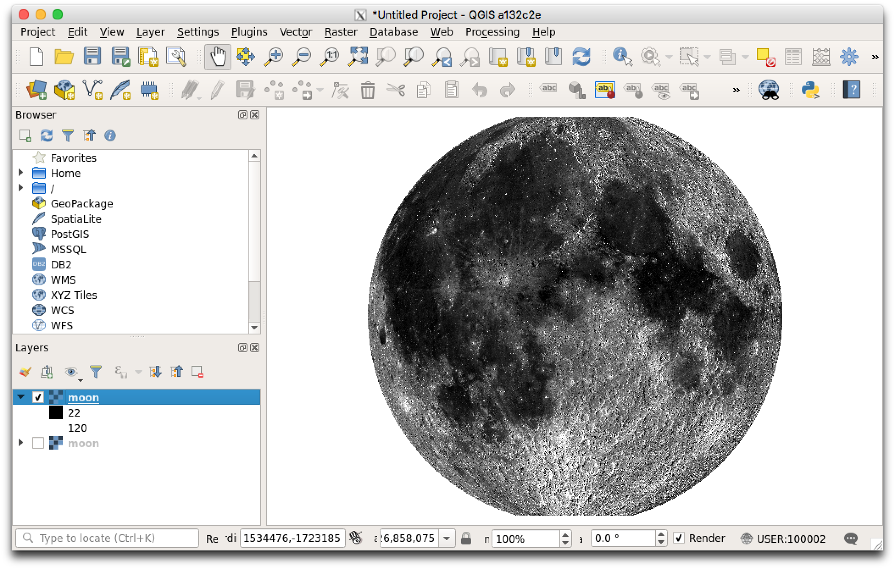


see e.g. wikipedia entry based on LRO data:


[wikipedia animation of near side of the Moon](https://en.wikipedia.org/wiki/Near_side_of_the_Moon#/media/File:Lunar_libration_with_phase_Oct_2007_450px.gif)

#### Hillshading

```
gdaldem hillshade moon.lola.cea.tif moon.lola.cea.shade.tif
```

produces from:

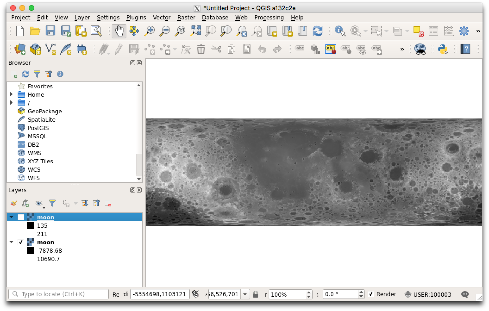

this:


### mosaic

assuming that all images have the same projection (CRS). There is no need to have the same pixel resolution.

e..g done for those images:

* EN0108828332M.lev2.cub
* EN0108828384M.lev2.cub
* EN0108828436M.lev2.cub
* EN0108828488M.lev2.cub
* EN0108829085M.lev2.cub
* EN0108830179M.lev2.cub

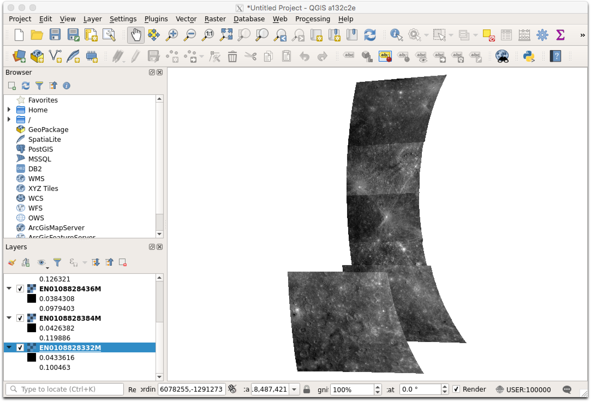

the command to mosaic them (provided that they  already have the same map projection, see [gdal_merge](https://www.gdal.org/gdal_merge.html))
```
gdal_merge.py -o mosaic-test-mercury.tif EN0108828332M.lev2.cub EN0108828384M.lev2.cub EN0108828436M.lev2.cub EN0108828488M.lev2.cub EN0108829085M.lev2.cub EN0108830179M.lev2.cub
```

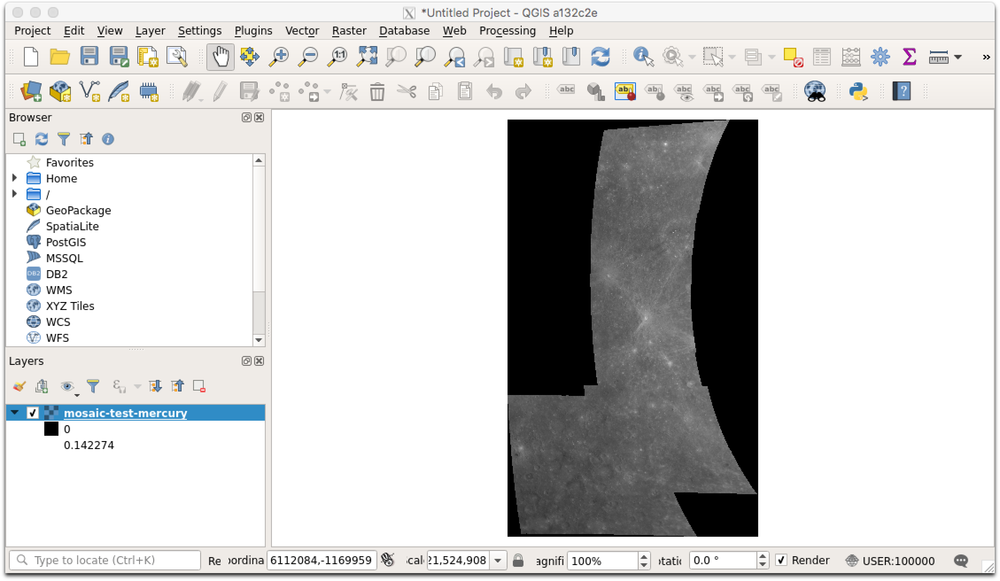

### Create RGB composite

e.g. with HRSC Level4 data (orthorectified with the same PixelResolution)

```
gdal_merge.py -separate  -o h0988_0000.rgb.tif  h0988_0000_re4.img h0988_0000_gr4.img h0988_0000_bl4.img

```

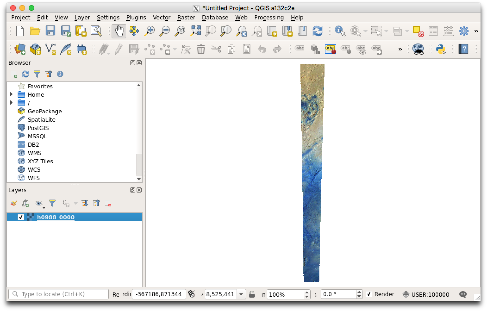

### Pan-sharpening

not sure if it works on a Raspberry Pi.. but please feel free try ;)

```
gdal_pansharpen.py h0988_0000_nd4.img h0988_0000.rgb.tif h0988_0000.rgb.pansharp.tif
```
normal RGB:

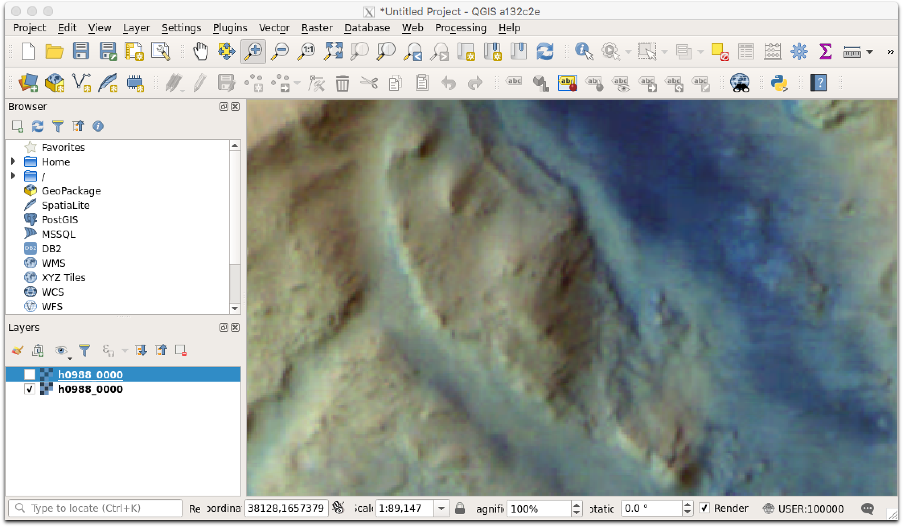

pan-sharpened RGB:

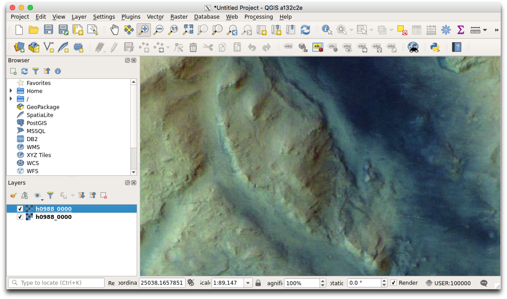
